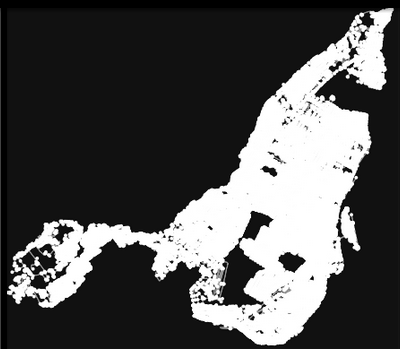
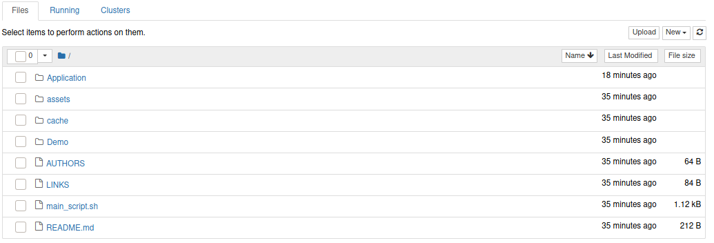
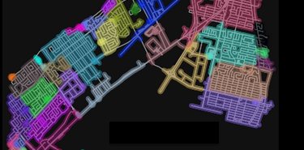

<i>Ce readme est à ouvrir sur github pour une plus grande clarté et lisibilité: </i> https://github.com/MrFey/deneigement_montreal

<h1>Projet de Deineigement intelligent pour la ville de Montréal</h1>
  Un projet dans le cadre de notre formation a EPITA plus particulièrement du cours ERO1.
 <!-- Instructions d'installation et d'execution + descriptif de la structure du rendu -->

<h2> Sujet </h2>  
  
Les Montréalais sont concernés par les questions de déneigement, mais la question d’augmentation du budget reste un point délicat pour le conseil municipal de la ville, il s’agit désormais de réduire au mieux le coût des opérations de déneigement, tout en offrant aux montréalais un service efficace. La municipalité confie à votre entreprise mère la charge d’effectuer une étude dans le but de minimiser le coût des opérations de déblaiement. Votre équipe est chargée d’étudier le moyen de minimiser le trajet des appareils de déblaiement du réseau routier dans Montréal, tout en garantissant que toute la zone qui vous est affectée soit traitée.Il a été constaté que les niveaux neigeux des routes de la ville variaient grandement et qu’il n’est pastoujours nécessaire d’effectuer les opérations de déblaiement sur tout le réseau. Votre hiérarchie a considéré comme judicieux, quand cela est possible, d’effectuer une analyse aérienne par drone des niveaux neigeux, celapermettra de limiter les opérations de déblaiement aux routes les plus concernées. Votre mission est:

  
  
  -  de déterminer le trajet minimal du drone lors du survol du réseau routier, celui-ci doit effectuer un examen complet du réseau routier pour pouvoir apporter une analyse suffisamment fine.
  -  de déterminer le trajet minimal d’un appareil de déblaiement d’une zone de la ville, celui-ci ne parcourt que dans un sens les routes à double sens.
  
  
<h4>Regardez notre vidéo de présentation</h4>

<h4>Vous pouvez aussi regarder notre pdf de <a href="/assets/readme/synthese.pdf">synthèse</a>.</h4>
<h2> Installation </h2>
  <h3>Clonage du repo git</h3>
  <!-- HTML generated using hilite.me -->
<pre style="margin: 0; line-height: 125%">git clone https://github.com/CACTUS-APPERO/APERRO.git

cd APERRO</pre>

  <h3>Installations des frameworks necessaires</h3>
  
Pour ce projet, nous avons eu besoin des frameworks et packages suivants: <i>Jupyter Notebook</i>, <i>Osmnx</i>, <i> Networkx </i>

  <h5>Vous pouvez les installer avec la commande suivante:</h5>
  <!-- HTML generated using hilite.me -->
<pre style="margin: 0; line-height: 125%">./setup.sh
</pre>

  
<h2> Execution </h2>
<h3> Execution Automatique </h3>
En executant ce script, jupyter se lancera en arrière plan et toutes les pages du projets s'ouvriront dans firefox.
<!-- HTML generated using hilite.me -->
<pre style="margin: 0; line-height: 125%">./main_script.sh
</pre>

<h3> Execution manuelle </h3>
Autrement, vous pouvez vous-même lancer jupyter.
  <!-- HTML generated using hilite.me -->
<pre style="margin: 0; line-height: 125%">jupyter-notebook 
</pre>

 
Enfin, vous aurrez accès au note book et aux deux sous-répertoires Demo et Application:

 La partie Démo est réservée à l'explication des algorithmes que nous avons choisis d'utiliser pour répondre aux problèmes posés.

<!-- HTML generated using hilite.me -->
<pre style="margin: 0; line-height: 125%">Demo
├── cache
├── project_appero_deneigeuse.ipynb
├── project_appero_drone.ipynb
└── scripts
</pre>

 La partie Application est la mise en oeuvre de nos algorithmes à l'echelle de Montréal et avec une visualisation des résultats grace au package OSMNX.
 Preview:  

<!-- HTML generated using hilite.me -->
<pre style="margin: 0; line-height: 125%">Application
├── cache
├── old_paths
├── old_sub_graphs
├── project_appero_deneigeuses.ipynb
├── project_appero_drone.ipynb
└── scripts
</pre>

En cliquant sur les différents <i>.ipynb</i> Vous pourrez accéder aux scripts et aux démonstrations que nous avons faits.

Auteurs:
  - Paul Beaunieux
  - Aurelien Calixte 
  - Melvin Le Gras
  - Arthur Naullet 

-- Ing1 EPITA

